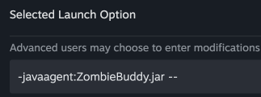
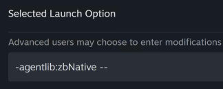

# ZombieBuddy

A powerful framework for Project Zomboid modders that enables Java bytecode manipulation and runtime patching of game classes using ByteBuddy.

## What is ZombieBuddy?

ZombieBuddy is a Java agent-based framework that allows modders to:
- **Patch game classes at runtime** using bytecode manipulation
- **Expose Java classes to Lua** for enhanced modding capabilities
- **Apply patches declaratively** using simple annotations
- **Load Java code from mods** seamlessly

Built on top of [ByteBuddy](https://bytebuddy.net/), ZombieBuddy provides a clean, annotation-based API for intercepting and modifying game behavior without requiring access to the game's source code.

## ☕ Support the Project

If you find ZombieBuddy useful and would like to support its development, consider buying me a coffee! Your support helps keep this project maintained and improved.

[](https://ko-fi.com/zed_0xff)

### Why ZombieBuddy?

Previously, Java mods for Project Zomboid required bundling `.class` files and manually replacing game files to work. ZombieBuddy makes this process much better:

1. **No manual file replacement**: ZombieBuddy automatically loads and applies patches at runtime - no need to manually copy `.class` files into the game's installation directory.

2. **Precise patching**: Instead of replacing entire class files, you can patch specific methods with surgical precision. This means:
   - Multiple mods can patch the same class without conflicts
   - Updates to the game are less likely to break your mod
   - You only modify what you need, leaving the rest of the class intact

## Features

- 🎯 **Annotation-based patching**: Use `@Patch` annotations to declare method patches
- 🔄 **Runtime class transformation**: Patch classes that are already loaded using retransformation
- 📦 **Automatic patch discovery**: Scans for patch classes automatically
- 🔗 **Lua integration**: Expose Java classes to Lua scripting with ease
- ⚡ **Advice and Method Delegation**: Support for both advice-based and delegation-based patching
- 🔍 **Verbose logging**: Configurable verbosity levels for debugging

## Screenshots

<!-- Add screenshots here showing:
- Steam launch options configuration (showing -javaagent:ZombieBuddy.jar --)
- Example of a patch in action
- Console output showing patches being applied
- Any UI elements if applicable
-->

## Installation

### For End Users

> **⚠️ SECURITY WARNING**: Unlike Lua mods which run in a sandboxed environment, **Java mods are completely unrestricted** and can execute any code with full system permissions. By installing ZombieBuddy and enabling Java mods, you are granting them the ability to:
> - Access and modify any game files or data
> - Access your file system outside the game directory
> - Perform network operations
> - Execute any Java code without restrictions
> 
> **Only install and enable Java mods from sources you trust completely.** Review the source code if available, and be aware that malicious Java mods could potentially harm your system or compromise your data. You install and use Java mods at your own risk.

**Important**: ZombieBuddy requires manual installation as it runs as a Java agent. Follow these steps carefully:

1. **Download the mod** from the Steam Workshop or GitHub releases

2. **Extract the mod** to your Project Zomboid mods directory:
   - **Windows**: `%USERPROFILE%\Zomboid\mods\ZombieBuddy\`
   - **Linux/Mac**: `~/Zomboid/mods/ZombieBuddy/`

3. **Copy files to the game directory**:
   
   **macOS and Linux**:
   - Copy `ZombieBuddy.jar` from the mod's `build/libs/` directory to:
     - **macOS**: `~/Library/Application Support/Steam/steamapps/common/ProjectZomboid/Project Zomboid.app/Contents/Java/`
     - **Linux**: The equivalent Java directory in your Steam installation (typically `~/.steam/steam/steamapps/common/ProjectZomboid/projectzomboid/java/`)
   
   **Windows**:
   - Copy **both** `ZombieBuddy.jar` and `zbNative.dll` from the mod's `build/libs/` directory to the game directory:
     - Typically: `C:\Program Files (x86)\Steam\steamapps\common\ProjectZomboid\`
     - Or wherever your Steam installation is located
   
   > **Note**: On Windows, `zbNative.dll` is required because the JRE hardcodes the path to `jre64\bin\instrument.dll`, which depends on `java.dll` and `jli.dll` that are not on the DLL load path. The native loader adds `jre64\bin` to the DLL load path and then proxies calls to `instrument.dll`. Source code for `zbNative.dll` is provided in the repository.

### Why is zbNative.dll needed on Windows?

On Windows, when using `-javaagent:ZombieBuddy.jar`, the JRE attempts to load `jre64\bin\instrument.dll` (the path is hardcoded in the JRE). However, this DLL depends on `java.dll` and `jli.dll`, which are also located in `jre64\bin` but are not on the DLL load path. This causes the loading of `instrument.dll` to fail.

The solution is `zbNative.dll`, a native library that:
1. Adds `jre64\bin` to the DLL load path
2. Proxies calls to `instrument.dll`
3. Automatically loads `ZombieBuddy.jar` as a Java agent

This is why Windows users must:
- Copy both `ZombieBuddy.jar` and `zbNative.dll` to the game directory
- Use only `-agentlib:zbNative --` in launch options (it automatically loads `ZombieBuddy.jar`)

On macOS and Linux, this workaround is not needed, so only `ZombieBuddy.jar` is required and you use `-javaagent:ZombieBuddy.jar --` directly.

4. **Modify game launch options**:
   - Open Steam and go to Project Zomboid properties
   - Navigate to "Launch Options" or "Set Launch Options"
   - Add one of the following (see screenshot below):
   
   **macOS and Linux**:
     ```
     -javaagent:ZombieBuddy.jar --
     ```
     Or with verbosity for debugging (shows patch transformations):
     ```
     -javaagent:ZombieBuddy.jar=verbosity=1 --
     ```
     Or with maximum verbosity (shows all debug output):
     ```
     -javaagent:ZombieBuddy.jar=verbosity=2 --
     ```
   
   **Windows**:
     ```
     -agentlib:zbNative --
     ```
     Or with verbosity for debugging:
     ```
     -agentlib:zbNative=verbosity=1 --
     ```
     Or with maximum verbosity:
     ```
     -agentlib:zbNative=verbosity=2 --
     ```
     > **Note**: `zbNative.dll` automatically loads `ZombieBuddy.jar` as a Java agent, so you don't need to specify `-javaagent:ZombieBuddy.jar` separately.
   
   - **⚠️ IMPORTANT**: The `--` at the end is **mandatory** - do not omit it!
   - **Windows users**: Only `-agentlib:zbNative --` is required (it automatically loads `ZombieBuddy.jar`)
   - **Verbosity levels**:
     - `verbosity=0` (default): Errors only
     - `verbosity=1`: Shows patch transformations
     - `verbosity=2`: Shows all debug output

5. **Enable the mod** in the Project Zomboid mod manager (if you want to use mods that depend on ZombieBuddy)

6. **Launch the game** - ZombieBuddy will load automatically as a Java agent

7. **Verify installation**: You can confirm ZombieBuddy is working by checking:
   - **Game version string**: Look for `[ZB]` appended to the game version (e.g., "Build 42.30.16 [ZB]")
   - **Loading screen**: The ZombieBuddy version (e.g., "ZB 1.0.2") appears at the bottom right corner during game loading
   - **Main menu**: The ZombieBuddy version is visible at the bottom right corner of the main menu screen

**Steam Launch Options Configuration:**

**macOS/Linux:**


**Windows:**


> **Note**: The installation dialog will also display this image when ZombieBuddy is not properly installed.

### For Modders

ZombieBuddy enables you to create Java mods that can patch game classes and expose Java functionality to Lua. Here's how to build a Java mod:

#### 1. Set Up Your Mod Structure

Create a standard Project Zomboid mod structure:
```
YourMod/
├── [version]/
│   ├── mod.info
│   └── media/
│       └── java/
│           └── YourMod.jar
└── common/
```

#### 2. Configure mod.info

Add the following entries to your `mod.info` file:

```ini
require=\ZombieBuddy
javaJarFile=media/java/YourMod.jar
javaPkgName=com.yourname.yourmod
```

- `require=\ZombieBuddy`: Declares dependency on ZombieBuddy framework
- `javaJarFile`: Path to your JAR file relative to the mod version directory. **Required** if you want to load Java code. **Note**: Only a single JAR file is supported per mod. Classes must be packaged in a JAR file - plain class directories are not supported.
- `javaPkgName`: The package name where your Main class is located (if present) and where patches will be discovered. **Mandatory** if `javaJarFile` is specified. The Main class (if present) must be named `Main` and located in this package (e.g., if `javaPkgName=com.yourname.yourmod`, the Main class must be `com.yourname.yourmod.Main`). The JAR file must contain this package. **Note**: The Main class is optional - if you only have patches and no initialization code, you can omit it. ZombieBuddy will still apply patches from the package.

**Important**: 
- `javaPkgName` is **mandatory** when `javaJarFile` is specified
- The Main class is always named `Main` (if present)
- The Main class is **optional** - patches will be applied even if Main class doesn't exist
- The JAR file must contain the package specified in `javaPkgName`
- Only one `javaJarFile` and one `javaPkgName` entry per mod (multiple entries are not supported)

#### 3. Create Your Java Project

Set up a Gradle project with the following dependencies:

```gradle
dependencies {
    // ZombieBuddy API (compile-only, provided at runtime)
    compileOnly files("path/to/ZombieBuddy.jar")
    
    // Project Zomboid classes (compile-only)
    compileOnly files("path/to/ProjectZomboid/Contents/Java")
}
```

#### 4. Write Your Mod Code

**Option A: With Main class** (for initialization code)

Create a Main class in the package specified by `javaPkgName`. The `main(String[])` method is optional - if it exists, it will be automatically executed when the mod loads:

```java
package com.yourname.yourmod;

public class Main {
    // Optional: main() method will be executed if present
    public static void main(String[] args) {
        System.out.println("[YourMod] Initializing...");
        
        // Your initialization code here
        // You can create patches, expose classes to Lua, etc.
    }
}
```

**Option B: Patches-only mod** (no Main class required)

If your mod only contains patches and doesn't need any initialization code, you can omit the Main class entirely. ZombieBuddy will automatically discover and apply all `@Patch` annotated classes in the package specified by `javaPkgName`.

**Important**: 
- The Main class is **optional** - if present, it must be named `Main` and be in the package specified by `javaPkgName` in `mod.info`
- Even without a Main class, any `@Patch` annotated classes in the package will be discovered and applied automatically

#### 5. Create Patches

```java
package com.yourname.yourmod.patches;

import me.zed_0xff.zombie_buddy.Patch;

@Patch(className = "zombie.SomeGameClass", methodName = "someMethod", warmUp = true)
public static class MyPatch {
    @Patch.OnEnter
    public static void enter() {
        System.out.println("[YourMod] Intercepted method call!");
    }
    
    @Patch.OnExit
    public static void exit() {
        System.out.println("[YourMod] Method finished!");
    }
}
```

**Important**: 
- Place patch classes in the same package as your Main class (specified by `javaPkgName`). ZombieBuddy will automatically discover and apply all `@Patch` annotated classes in that package.

#### 6. Expose Classes to Lua

To make your Java classes accessible from Lua scripts:

```java
import me.zed_0xff.zombie_buddy.Exposer;

// In your initialization code
Exposer.exposeClassToLua(MyCustomClass.class);
```

#### 7. Build Your Mod

Build your JAR file and place it in the location specified in `mod.info`:

```bash
gradle build
cp build/libs/YourMod.jar ~/Zomboid/mods/YourMod/[version]/media/java/
```

#### 8. Testing

1. Ensure ZombieBuddy is installed and configured (see "For End Users" above)
2. Enable your mod in the Project Zomboid mod manager
3. Launch the game and check the console for your mod's output
4. Use `-javaagent:ZombieBuddy.jar=verbosity=2 --` in launch options for detailed patch logging

#### Tips

- **Package naming**: Use a unique package name to avoid conflicts (e.g., `com.yourname.yourmod`)
- **Warm-up classes**: Some game classes need to be "warmed up" before patching. Set `warmUp = true` in your `@Patch` annotation
- **Advice vs Delegation**: Use `isAdvice = true` (default) for intercepting methods. Use `isAdvice = false` for complete method replacement (only one delegation per method)
- **Retransformation**: Patches can be applied to already-loaded classes, but MethodDelegation patches work best on classes that haven't loaded yet

#### Example Mods

Looking for examples to learn from? Check out these mods built with ZombieBuddy:

- **[ZBHelloWorld](https://github.com/zed-0xff/ZBHelloWorld)**: A simple example mod demonstrating how to patch UI rendering methods. Shows the basic structure with `javaPkgName` and a Main class.

#### Sharing Your Source Code

We strongly encourage modders to share their source code with the community! This helps others learn, contribute, and maintain mods when you're unavailable. Here are two great options:

1. **Bundle source with your mod**: Include a `src/` directory in your mod distribution containing your Java source files. This makes it easy for users to inspect and understand your mod's implementation.

2. **Share on GitHub**: Create a public GitHub repository for your mod. This enables:
   - Version control and issue tracking
   - Community contributions via pull requests
   - Easy collaboration with other modders
   - Better discoverability and documentation

Example mod structure with source:
```
YourMod/
├── [version]/
│   ├── mod.info
│   ├── media/
│   │   └── java/
│   │       └── YourMod.jar
│   └── src/              # Optional: include source code
│       └── com/
│           └── yourname/
│               └── yourmod/
└── common/
```

Open source mods benefit the entire Project Zomboid modding community by enabling learning, collaboration, and long-term maintenance!

## How It Works

ZombieBuddy operates as a Java agent that:

1. **Loads at game startup** via the Java Instrumentation API
2. **Scans for patch classes** annotated with `@Patch`
3. **Applies bytecode transformations** using ByteBuddy
4. **Supports both new and already-loaded classes** through retransformation

### Creating a Patch

```java
import me.zed_0xff.zombie_buddy.Patch;

@Patch(className = "zombie.SomeGameClass", methodName = "someMethod", warmUp = true)
public static class MyPatch {
    @Patch.OnEnter
    public static void enter() {
        System.out.println("Method called!");
    }
    
    @Patch.OnExit
    public static void exit() {
        System.out.println("Method finished!");
    }
}
```

### Exposing Classes to Lua

```java
import me.zed_0xff.zombie_buddy.Exposer;

// In your mod's initialization code
Exposer.exposeClassToLua(MyCustomClass.class);
```

## Requirements

- **Project Zomboid** (latest version)
- **Java 17** (required by the game)
- **Gradle** (for building Java mods)

## License

Copyright (c) 2025 Andrey "Zed" Zaikin

This project is licensed under a permissive open-source license. See [LICENSE.txt](LICENSE.txt) for details.

## Contributing

Contributions are welcome! Please feel free to submit issues or pull requests.

## Links

- **GitHub**: https://github.com/zed-0xff/ZombieBuddy
- **Example Mod**: [ZBHelloWorld](https://github.com/zed-0xff/ZBHelloWorld) - A simple example mod demonstrating patches-only mods
- **Author**: zed-0xff

## Disclaimer

This mod uses bytecode manipulation to modify game behavior. **Java mods enabled through ZombieBuddy have unrestricted access to your system and can execute arbitrary code.** Use at your own risk. Always backup your save files before using mods that modify core game functionality. Only install Java mods from trusted sources and review their source code when available.

