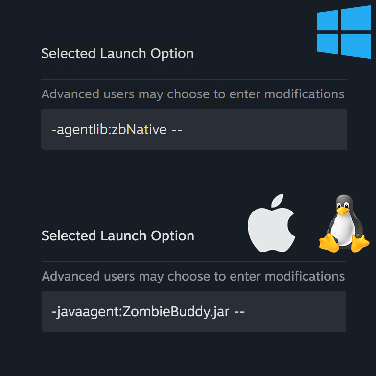

# ZombieBuddy Installation Guide

This guide covers installing ZombieBuddy for end users who want to use Java mods.

---

## Security Warning

> **⚠️ IMPORTANT**: Unlike Lua mods which run in a sandboxed environment, **Java mods are completely unrestricted** and can execute any code with full system permissions. By installing ZombieBuddy and enabling Java mods, you are granting them the ability to:
> - Access and modify any game files or data
> - Access your file system outside the game directory
> - Perform network operations
> - Execute any Java code without restrictions
>
> **Only install and enable Java mods from sources you trust completely.** Review the source code if available, and be aware that malicious Java mods could potentially harm your system or compromise your data. You install and use Java mods at your own risk.
>
> To mitigate this, ZombieBuddy will **prompt you before loading any new or changed Java mod JAR** (see [Java Mod Approval & Policy](#java-mod-approval--policy) below). No JAR is loaded until you explicitly approve it.

---

## Java Mod Approval & Policy

**No JAR will sneak in.** When ZombieBuddy sees a Java mod JAR it hasn't seen before (or a previously-approved JAR whose contents changed), it shows a native dialog with:

- The mod id
- The full path to the JAR
- The file's last-modified date
- The JAR's SHA-256 fingerprint

Nothing is loaded until you click **Yes**. A second dialog asks whether the decision should be **persisted** across game runs or kept **session-only**. Negative answers (deny) can be persisted too, so a mod you explicitly rejected never re-prompts you.

### Where decisions are stored

- **Windows:** `%USERPROFILE%\.zombie_buddy\mod_approvals.json`
- **macOS / Linux:** `~/.zombie_buddy/mod_approvals.json`

The file is JSON (with room for future top-level fields). Persisted allow/deny pairs live under `mods` as a nested object: each **mod id** maps to an object of **SHA-256 hex → JSON boolean** (`true` = allow, `false` = deny). To revoke a decision, edit or remove the matching mod/hash under `mods` and restart the game.

### Policy modes

Pass as a `policy=...` agent argument:

| Value        | Behavior                                                                                 |
|--------------|------------------------------------------------------------------------------------------|
| `prompt`     | (default) Ask via a native dialog for each unknown/changed JAR.                          |
| `deny-new`   | Silently skip any JAR that isn't already approved. No dialogs are shown.                 |
| `allow-all`  | Load every JAR without prompting. **Not recommended** - use only in controlled setups.   |

Example launch options:

- Windows: `-agentlib:zbNative=policy=deny-new --`
- macOS / Linux: `-javaagent:ZombieBuddy.jar=policy=deny-new --`

The policy is locked during `premain`, before any Java mod is on the classpath, so a later-loading Java mod cannot change it at runtime.

For all available command-line parameters, see [CommandLine.md](CommandLine.md).

---

## Windows (Automated Installer)

The easiest way to install ZombieBuddy on Windows is using the automated installer:

1. **Download the latest `ZombieBuddyInstaller.exe`** from the [GitHub Releases](https://github.com/zed-0xff/ZombieBuddy/releases/) page.
2. **Run the installer** and choose **Install or update ZombieBuddy**.
3. **Choose what launch mode to patch**:
   - **Both** (recommended): patches Normal Launch and Alternate Launch.
   - **Normal Launch**: then choose `ProjectZomboid64.json`, Steam launch options, or both.
   - **Alternate Launch**: patches `ProjectZomboid64.bat`.
4. **Review the confirmation preview**. The installer lists every system change before applying it.
5. **Confirm the changes** if they look correct.

The installer will:

- Detect your Steam and Project Zomboid installation folders.
- Find the ZombieBuddy Workshop content (ensure you are [subscribed on Steam](https://steamcommunity.com/sharedfiles/filedetails/?id=3619862853)).
- Copy `zbNative.dll` and `ZombieBuddy.jar` to your game directory.
- Patch the selected launcher locations:
  - `ProjectZomboid64.json` for Normal Launch.
  - Steam launch options with `-agentlib:zbNative --`, if selected.
  - `ProjectZomboid64.bat` for Alternate Launch.

If Steam launch options need to be changed, the installer asks you to close Steam at that point. It does not require Steam to be closed for launcher JSON/BAT edits or file copies.

---

## macOS and Linux (Manual Installation)

ZombieBuddy requires manual installation on these platforms as it runs as a Java agent. Follow the steps in the **Manual Installation** section below.

---

## Manual Installation

If you prefer to install manually on Windows, or are on macOS/Linux, follow these steps:

### 1. Download the mod

From the Steam Workshop or GitHub releases.

### 2. Extract the mod

Extract to your Project Zomboid mods directory:
- **Windows**: `%USERPROFILE%\Zomboid\mods\ZombieBuddy\`
- **Linux/Mac**: `~/Zomboid/mods/ZombieBuddy/`

### 3. Copy files to the game directory

**macOS and Linux**:
- Copy `ZombieBuddy.jar` from the mod's `build/libs/` directory to:
  - **macOS**: `~/Library/Application Support/Steam/steamapps/common/ProjectZomboid/Project Zomboid.app/Contents/Java/`
  - **Linux**: The equivalent Java directory in your Steam installation (typically `~/.steam/steam/steamapps/common/ProjectZomboid/projectzomboid/`)

**Windows**:
- Copy **both** `ZombieBuddy.jar` and `zbNative.dll` from the mod's `build/libs/` directory to the game directory:
  - Typically: `C:\Program Files (x86)\Steam\steamapps\common\ProjectZomboid\`
  - Or wherever your Steam installation is located

> **Note**: On Windows, `zbNative.dll` is required because the JRE hardcodes the path to `jre64\bin\instrument.dll`, which depends on `java.dll` and `jli.dll` that are not on the DLL load path. The native loader adds `jre64\bin` to the DLL load path and then proxies calls to `instrument.dll`. Source code for `zbNative.dll` is provided in the repository.

### Why is zbNative.dll needed on Windows?

On Windows, when using `-javaagent:ZombieBuddy.jar`, the JRE attempts to load `jre64\bin\instrument.dll` (the path is hardcoded in the JRE). However, this DLL depends on `java.dll` and `jli.dll`, which are also located in `jre64\bin` but are not on the DLL load path. This causes the loading of `instrument.dll` to fail.

The solution is `zbNative.dll`, a native library that:
1. Adds `jre64\bin` to the DLL load path
2. Proxies calls to `instrument.dll`
3. Automatically loads `ZombieBuddy.jar` as a Java agent
4. **Handles automatic updates**: On startup, `zbNative.dll` checks if `ZombieBuddy.jar.new` exists (created when a newer version is detected via Steam mod update but the JAR couldn't be replaced during runtime). If found, it automatically replaces `ZombieBuddy.jar` with the new version before loading it.

This is why Windows users must:
- Copy both `ZombieBuddy.jar` and `zbNative.dll` to the game directory
- Use only `-agentlib:zbNative --` in launch options (it automatically loads `ZombieBuddy.jar`)

On macOS and Linux, this workaround is not needed, so only `ZombieBuddy.jar` is required and you use `-javaagent:ZombieBuddy.jar --` directly.

### 4. Modify game launch options

Open Steam and go to Project Zomboid properties, then navigate to "Launch Options" or "Set Launch Options".

**macOS and Linux**:

```
-javaagent:ZombieBuddy.jar --
```

Or with verbosity for debugging (shows patch transformations):

```
-javaagent:ZombieBuddy.jar=verbosity=1 --
```

Or with maximum verbosity (shows all debug output):

```
-javaagent:ZombieBuddy.jar=verbosity=2 --
```

**Windows**:

```
-agentlib:zbNative --
```

Or with verbosity for debugging:

```
-agentlib:zbNative=verbosity=1 --
```

Or with maximum verbosity:

```
-agentlib:zbNative=verbosity=2 --
```

> **Note**: `zbNative.dll` automatically loads `ZombieBuddy.jar` as a Java agent, so you don't need to specify `-javaagent:ZombieBuddy.jar` separately.

**Important notes:**
- **⚠️ The `--` at the end is mandatory** - do not omit it!
- **Windows Normal Launch via Steam launch options**: Use `-agentlib:zbNative --` (it automatically loads `ZombieBuddy.jar`).
- **Windows Alternate Launch**: Steam launch options are passed to `ProjectZomboid64.bat` as game arguments, so `-agentlib:zbNative --` there is not enough. Add `-agentlib:zbNative` to the `SET _JAVA_OPTIONS=` line in `ProjectZomboid64.bat`, or use the installer and choose Alternate Launch / Both.
- **Verbosity levels**:
  - `verbosity=0` (default): Errors only
  - `verbosity=1`: Shows patch transformations
  - `verbosity=2`: Shows all debug output

For a complete list of command-line parameters, see [CommandLine.md](CommandLine.md).



### 5. Enable the mod

Enable ZombieBuddy in the Project Zomboid mod manager (if you want to use mods that depend on ZombieBuddy).

### 6. Launch the game

ZombieBuddy will load automatically as a Java agent.

---

## Verifying Installation

You can confirm ZombieBuddy is working by checking:

- **Game version string**: Look for `[ZB]` appended to the game version (e.g., "Build 42.30.16 [ZB]")
- **Loading screen**: The ZombieBuddy version (e.g., "ZB 1.0.2") appears at the bottom right corner during game loading
- **Main menu**: The ZombieBuddy version is visible at the bottom right corner of the main menu screen
